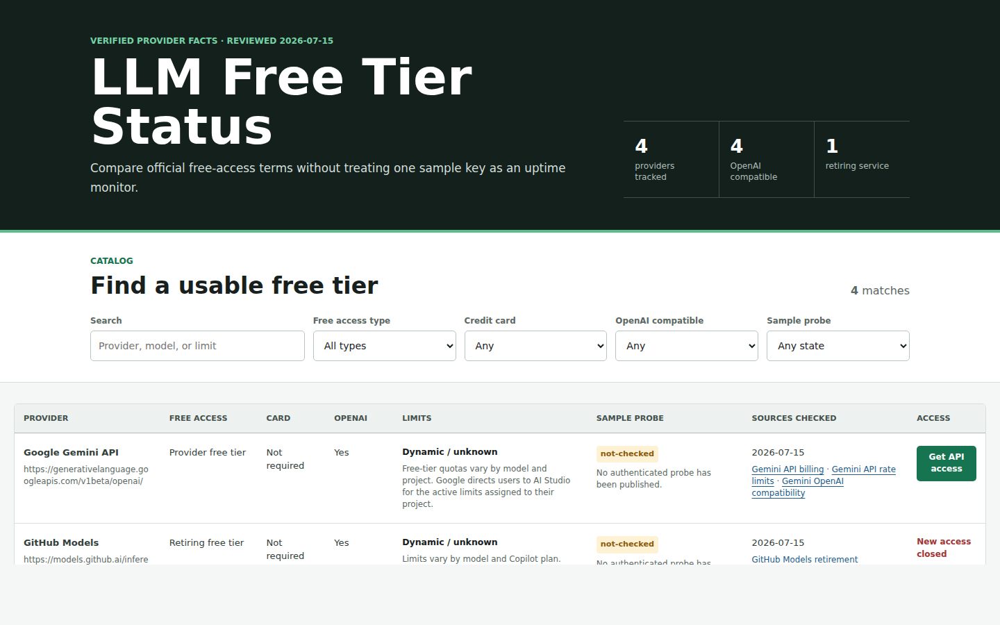

# Free LLM APIs

English · [简体中文](README_zh.md)

[](https://github.com/xyzs996/free-llm-api/actions/workflows/ci.yml)
[](LICENSE)
[](https://xyzs996.github.io/free-llm-api/)
[](https://xyzs996.github.io/free-llm-api/methodology.html)

Permanent free tiers, no-card options, direct API key links, models, and verified limits — every claim points to an official source.

> 15 permanent provider free tiers · 15 require no credit card · 15 are OpenAI compatible · sources reviewed 2026-07-25. No keys are distributed here. A probe describes one sampled request, not provider-wide uptime.

**[Browse the live directory](https://xyzs996.github.io/free-llm-api/) · [Pick by model](https://xyzs996.github.io/free-llm-api/#browse) · [Set up a coding agent](docs/clients.md) · [Check your own key](https://xyzs996.github.io/free-llm-api/verify.html)**

[](https://xyzs996.github.io/free-llm-api/)

Star this repository to bookmark the dataset and follow releases. A star changes nothing about any provider's keys, credits, or limits, and this project gives nothing in return for one.

## Pick a free API by goal

| Goal | Pick | Why it appears here | Start |
| --- | --- | --- | --- |
| Highest published daily request limit | [GroqCloud](https://xyzs996.github.io/free-llm-api/provider/groq.html) | 1,000 requests/day published | [Get API key](https://console.groq.com/keys) |
| Highest published requests per minute | [SiliconFlow](https://xyzs996.github.io/free-llm-api/provider/siliconflow.html) | 1,000 RPM published | [Get API key](https://cloud.siliconflow.com/account/ak) |
| Works with the browser key checker | [Google Gemini API](https://xyzs996.github.io/free-llm-api/provider/gemini.html) | Browser CORS check supported | [Get API key](https://aistudio.google.com/apikey) |
| Fast path for coding agents | [GroqCloud](https://xyzs996.github.io/free-llm-api/provider/groq.html) | Documented OpenAI-compatible coding setup | [Get API key](https://console.groq.com/keys) |

These are rule-based shortcuts, not paid placements. Open the [filterable directory](https://xyzs996.github.io/free-llm-api/) for all 26 providers.

Free is not the same as cheap enough to keep running, and the number you need is what replaces the free tier once it runs out. Same maintainer, [one table of every figure they have cited](https://xyzs996.github.io/ai-coding-field-notes/figures.html) — anything carrying a unit — with **the full sentence it came from** on every row. The per-million-token prices out of it:

| Price | Unit | The sentence it was published in |
| --- | --- | --- |
| `$0.06 / $0.2` | per million | At the low end, MiniMax M3 runs $0.06 to $0.2 per million and draws 60% to 70% of its revenue from outside its home market. [→](https://xyzs996.github.io/ai-coding-field-notes/articles/1-6-billion-free-tokens-is-a-compression-ratio-not-a.html) |
| `$0.19 / $5` | per million tokens | Chinese AI models provide a cost-effective alternative to their American counterparts, with input costs as low as $0.19 per million tokens, compared to OpenAI's $5-12. [→](https://xyzs996.github.io/ai-coding-field-notes/articles/how-chinese-ai-agent-tools-leverage-1-6-billion-free-tokens.html) |
| `$1` | per million tokens | Top-tier Chinese models such as GLM5.2 and DeepSeek V4 Pro sit near $1 per million tokens at inference gross margins of 10% to 20%. [→](https://xyzs996.github.io/ai-coding-field-notes/articles/1-6-billion-free-tokens-is-a-compression-ratio-not-a.html) |
| `$1.25 / $4.25` | per million | Meta priced Muse Spark 1.1 at $1.25 per million input and $4.25 per million output, roughly 75% and 83% below Anthropic's Opus, and the tradeoff is visible in the benchmarks, since it leads on MCP Atlas and JobBench while trailing on SWE-Bench Pro and DeepSWE 1.1. [→](https://xyzs996.github.io/ai-coding-field-notes/articles/1-6-billion-free-tokens-is-a-compression-ratio-not-a.html) |
| `$3` | per million input tokens | The $3 per million input tokens price point means developers should carefully evaluate whether the premium model's capabilities justify the increased costs for their specific use cases. [→](https://xyzs996.github.io/ai-coding-field-notes/articles/choosing-the-right-ai-model-for-coding-cost-vs-efficiency.html) |

A `$1.43` is never left ambiguous between per million tokens, per month and per seat, because the sentence travels with it. Readable in code as [JSON or CSV](https://cdn.jsdelivr.net/gh/xyzs996/ai-coding-field-notes@main/data/figures.json), or as prose: [where the token bill actually goes](https://xyzs996.github.io/ai-coding-field-notes/articles/token-optimization-for-indie-developers-ai-api-bills.html).

## Permanent free tiers

These Provider Free Tiers are the main list: they do not expire like trial credits, and none currently require a credit card.

| Provider | Models | Published limits | Card | OpenAI compatible | Get API key |
| --- | --- | --- | --- | --- | --- |
| [Google Gemini API](https://xyzs996.github.io/free-llm-api/provider/gemini.html) | Free-tier eligibility varies by model<br>gemini-2.5-flash<br>gemini-2.5-flash-lite | [Dynamic / model-dependent](https://ai.google.dev/gemini-api/docs/rate-limits) | Not required | Yes | [Open](https://aistudio.google.com/apikey) |
| [GroqCloud](https://xyzs996.github.io/free-llm-api/provider/groq.html) | llama-3.3-70b-versatile<br>llama-3.1-8b-instant<br>openai/gpt-oss-120b | [30 RPM, 1,000 requests/day](https://console.groq.com/docs/rate-limits) | Not required | Yes | [Open](https://console.groq.com/keys) |
| [SambaNova Cloud](https://xyzs996.github.io/free-llm-api/provider/sambanova.html) | DeepSeek-V3.1<br>Meta-Llama-3.3-70B-Instruct<br>gpt-oss-120b | [20 RPM, 20 requests/day](https://sambanova-systems.mintlify.dev/docs/en/models/rate-limits.md) | Not required | Yes | [Open](https://cloud.sambanova.ai/apis) |
| [Cohere](https://xyzs996.github.io/free-llm-api/provider/cohere.html) | command-a-03-2025<br>command-r-plus<br>embed-v4.0 | [20 RPM](https://docs.cohere.com/docs/rate-limits) | Not required | Yes | [Open](https://dashboard.cohere.com/api-keys) |
| [Cloudflare Workers AI](https://xyzs996.github.io/free-llm-api/provider/cloudflare-workers-ai.html) | @cf/meta/llama-3.3-70b-instruct-fp8-fast<br>@cf/openai/gpt-oss-120b<br>@cf/qwen/qwen2.5-coder-32b-instruct | [Dynamic / model-dependent](https://developers.cloudflare.com/workers-ai/platform/pricing/) | Not required | Yes | [Open](https://dash.cloudflare.com/profile/api-tokens) |
| [Hugging Face Inference Providers](https://xyzs996.github.io/free-llm-api/provider/huggingface.html) | deepseek-ai/DeepSeek-V3-0324<br>openai/gpt-oss-120b<br>200+ models routed across partner providers | [Dynamic / model-dependent](https://huggingface.co/docs/inference-providers/pricing) | Not required | Yes | [Open](https://huggingface.co/settings/tokens) |
| [SiliconFlow](https://xyzs996.github.io/free-llm-api/provider/siliconflow.html) | Qwen/Qwen3-8B<br>THUDM/GLM-4-9B-0414<br>deepseek-ai/DeepSeek-R1 | [1,000 RPM](https://docs.siliconflow.com/en/userguide/rate-limits/rate-limit-and-upgradation) | Not required | Yes | [Open](https://cloud.siliconflow.com/account/ak) |
| [Fireworks AI](https://xyzs996.github.io/free-llm-api/provider/fireworks.html) | accounts/fireworks/models/llama-v3p3-70b-instruct<br>accounts/fireworks/models/gpt-oss-120b | [10 RPM](https://docs.fireworks.ai/guides/quotas_usage/account-quotas) | Not required | Yes | [Open](https://app.fireworks.ai/settings/users/api-keys) |
| [Z.AI Open Platform](https://xyzs996.github.io/free-llm-api/provider/zai.html) | GLM-4.7-Flash<br>GLM-4.5-Flash | [Dynamic / model-dependent](https://docs.z.ai/guides/overview/pricing) | Not required | Yes | [Open](https://z.ai/manage-apikey/apikey-list) |
| [Novita AI](https://xyzs996.github.io/free-llm-api/provider/novita.html) | inclusionai/Ling-3.0-flash<br>Mind Lab Macaron V1 Venti | [Dynamic / model-dependent](https://novita.ai/pricing) | Not required | Yes | [Open](https://novita.ai/settings/key-management) |
| [Mistral La Plateforme](https://xyzs996.github.io/free-llm-api/provider/mistral.html) | mistral-small-latest<br>open-mistral-nemo<br>codestral-latest | [Dynamic / model-dependent](https://docs.mistral.ai/) | Not required | Yes | [Open](https://console.mistral.ai/api-keys) |
| [Alibaba Cloud Model Studio](https://xyzs996.github.io/free-llm-api/provider/dashscope.html) | qwen-plus<br>qwen-turbo<br>qwen3-coder-plus | [Dynamic / model-dependent](https://www.alibabacloud.com/help/en/model-studio/rate-limit) | Not required | Yes | [Open](https://bailian.console.alibabacloud.com/) |
| [Moonshot AI (Kimi)](https://xyzs996.github.io/free-llm-api/provider/moonshot.html) | kimi-k2-0905-preview<br>moonshot-v1-8k<br>moonshot-v1-128k | [Dynamic / model-dependent](https://platform.moonshot.ai/docs/pricing/limits) | Not required | Yes | [Open](https://platform.moonshot.ai/console/api-keys) |
| [Pollinations.AI](https://xyzs996.github.io/free-llm-api/provider/pollinations.html) | openai<br>mistral<br>Community-hosted open models | [Dynamic / model-dependent](https://github.com/pollinations/pollinations/blob/master/APIDOCS.md) | Not required | Yes | [Open](https://pollinations.ai/) |
| [Ollama Cloud](https://xyzs996.github.io/free-llm-api/provider/ollama-cloud.html) | gpt-oss:120b-cloud<br>gpt-oss:20b-cloud<br>qwen3-coder:480b-cloud | [Dynamic / model-dependent](https://docs.ollama.com/cloud) | Not required | Yes | [Open](https://ollama.com/settings/keys) |

## Other access options

These entries can still be useful, but they are aggregators, trial credits, retiring tiers, or metered services — not permanent Provider Free Tiers.

| Provider | Access type | Models | Published limits | Card | OpenAI compatible | Get API key |
| --- | --- | --- | --- | --- | --- | --- |
| [Cerebras Inference](https://xyzs996.github.io/free-llm-api/provider/cerebras.html) | Free trial credit | gpt-oss-120b<br>zai-glm-4.7<br>gemma-4-31b | [5 RPM](https://inference-docs.cerebras.ai/support/rate-limits) | Required | Yes | [Open](https://cloud.cerebras.ai/) |
| [Vercel AI Gateway](https://xyzs996.github.io/free-llm-api/provider/vercel-ai-gateway.html) | Free trial credit | Free Tier eligible model subset<br>openai/gpt-oss-120b<br>moonshotai/kimi-k2 | [Dynamic / model-dependent](https://vercel.com/docs/ai-gateway/pricing) | Not required | Yes | [Open](https://vercel.com/dashboard/ai-gateway) |
| [IBM watsonx.ai](https://xyzs996.github.io/free-llm-api/provider/watsonx.html) | Free trial credit | ibm/granite-3-8b-instruct<br>meta-llama/llama-3-3-70b-instruct<br>mistralai/mistral-large | [Dynamic / model-dependent](https://www.ibm.com/products/watsonx-ai/pricing) | Not required | No | [Open](https://dataplatform.cloud.ibm.com/registration/stepone) |
| [OpenRouter](https://xyzs996.github.io/free-llm-api/provider/openrouter.html) | Free model aggregator | Model IDs ending in :free<br>openrouter/free | [20 RPM, 50 requests/day](https://openrouter.ai/docs/api-reference/limits) | Not required | Yes | [Open](https://openrouter.ai/settings/keys) |
| [GitHub Models](https://github.blog/changelog/2026-07-01-github-models-is-being-fully-retired-on-july-30-2026/) | Retiring free tier<br>Retires 2026-07-30 | Existing-customer catalog only until retirement | [Dynamic / model-dependent](https://github.blog/changelog/2026-07-01-github-models-is-being-fully-retired-on-july-30-2026/) | Not required | Yes | Closed to new users |
| [Together AI](https://xyzs996.github.io/free-llm-api/provider/together.html) | Metered access | meta-llama/Llama-3.3-70B-Instruct-Turbo<br>openai/gpt-oss-120b<br>Qwen/Qwen3-Coder-480B-A35B-Instruct-Turbo | [Dynamic / model-dependent](https://docs.together.ai/docs/serverless/rate-limits) | Not required | Yes | [Open](https://api.together.ai/settings/api-keys) |
| [Nebius Token Factory](https://xyzs996.github.io/free-llm-api/provider/nebius.html) | Metered access | deepseek-ai/DeepSeek-V3<br>meta-llama/Llama-3.3-70B-Instruct<br>Qwen/Qwen3-235B-A22B | [60 RPM](https://docs.tokenfactory.nebius.com/ai-models-inference/rate-limits) | Not required | Yes | [Open](https://tokenfactory.nebius.com/) |
| [Perplexity API](https://xyzs996.github.io/free-llm-api/provider/perplexity.html) | Metered access | sonar<br>sonar-pro<br>sonar-reasoning | [50 RPM](https://docs.perplexity.ai/docs/admin/rate-limits-usage-tiers) | Not required | Yes | [Open](https://www.perplexity.ai/account/api/keys) |
| [DeepInfra](https://xyzs996.github.io/free-llm-api/provider/deepinfra.html) | Metered access | deepseek-ai/DeepSeek-V3<br>Qwen/Qwen3-Next-80B-A3B-Instruct<br>meta-llama/Llama-4-Scout-17B-16E | [Dynamic / model-dependent](https://deepinfra.com/pricing) | Not required | Yes | [Open](https://deepinfra.com/dash/api_keys) |
| [Chutes](https://xyzs996.github.io/free-llm-api/provider/chutes.html) | Metered access | zai-org/GLM-5<br>Qwen/Qwen3-32B<br>unsloth/Mistral-Nemo-Instruct-2407 | [Dynamic / model-dependent](https://chutes.ai/pricing) | Not required | Yes | [Open](https://chutes.ai/app/api) |
| [Scaleway Generative APIs](https://xyzs996.github.io/free-llm-api/provider/scaleway.html) | Metered access | llama-3.3-70b-instruct<br>gpt-oss-120b<br>qwen3-coder-30b-a3b-instruct | [Dynamic / model-dependent](https://www.scaleway.com/en/docs/generative-apis/reference-content/rate-limits/) | Required | Yes | [Open](https://console.scaleway.com/) |

Limits marked dynamic or model-dependent are intentionally not replaced with guessed numbers. Follow the linked official source for the current quota.

## Quick start

After creating your own Groq API key, the OpenAI SDK needs only a different Base URL and model id:

```python
import os
from openai import OpenAI

client = OpenAI(
    api_key=os.environ["GROQ_API_KEY"],
    base_url="https://api.groq.com/openai/v1",
)

response = client.chat.completions.create(
    model="llama-3.3-70b-versatile",
    messages=[{"role": "user", "content": "Say hello in one sentence."}],
)
print(response.choices[0].message.content)
```

For coding agents, generate a client-specific configuration that reads the key from your environment:

```bash
npx free-llm-api setup claude-code
```

Client guides: [Claude Code](docs/claude-code.md) · [Codex CLI](docs/codex.md) · [Cline](docs/cline.md) · [all clients](docs/clients.md).

## Check a key you already have

Open the [browser key checker](https://xyzs996.github.io/free-llm-api/verify.html). Nothing is installed or stored: the request goes from your browser straight to the chosen provider. Its Content Security Policy allows the 26 catalog origins and no analytics or project server. 21 providers answer cross-origin browser requests; blocked providers get an equivalent `curl` command.

## Why trust this list

- Every limit and lifecycle claim links to an official source and carries a review date.
- Trial credit, metered access, aggregators, and retiring tiers are separated from permanent free tiers.
- No working API keys are stored or distributed. Use environment variables for your own credentials.
- A probe describes one sampled request, not provider-wide uptime. A `429` does not reveal the key's remaining quota.

Run probes explicitly outside CI. Keys are read only from the provider environment variable:

```bash
GROQ_API_KEY=YOUR_API_KEY npm run probe -- --provider groq
```

The ignored `data/probe-output.json` contains only a bounded classification, status, latency, and timestamp — never the key, response body, or raw exception. Read the full [methodology](https://xyzs996.github.io/free-llm-api/methodology.html).

## Changed this week

Week of 2026-07-25. First published catalog: 26 providers, every published number traced to an official page checked this week.

- **Added (26):** Google Gemini API, GroqCloud, SambaNova Cloud, Cohere, Cloudflare Workers AI, Hugging Face Inference Providers, SiliconFlow, Fireworks AI, Z.AI Open Platform, Novita AI, Mistral La Plateforme, Alibaba Cloud Model Studio, Moonshot AI (Kimi), Pollinations.AI, Ollama Cloud, Cerebras Inference, Vercel AI Gateway, IBM watsonx.ai, OpenRouter, GitHub Models, Together AI, Nebius Token Factory, Perplexity API, DeepInfra, Chutes, Scaleway Generative APIs
- **Lifecycle — GitHub Models:** Free tier retires 2026-07-30, so the catalog carries no signup link for it.
- **Corrected — Cerebras Inference:** A verified payment method is a precondition for API access, so this is not a card-free free tier.
- **Corrected — Fireworks AI:** The 10 RPM cap for accounts without a payment method applies account-wide, not per model.

Every entry above is dated and sourced in the catalog below. Full history: [`data/changelog.json`](data/changelog.json).

## Contributing

Corrections are the contribution this project runs on: a limit that moved, a provider that closed signups, or a link that died. See [CONTRIBUTING.md](CONTRIBUTING.md) and the [issue templates](https://github.com/xyzs996/free-llm-api/issues/new/choose).

Not sure enough to file one? [Which free tier changed on you this week?](https://github.com/xyzs996/free-llm-api/discussions/1) takes a one-line reply with no link, no screenshot, and no source. Somebody else can go find the page.

## Data and local development

- `data/providers.json` is the reviewed source dataset.
- `data/changelog.json` records weekly changes.
- `README.md`, `docs/providers.json`, and the static pages are generated deterministically.
- `npm run validate` rejects stated quotas without an official source.

Run the generated site locally:

```bash
npm run render && npm run serve
```

Open `http://127.0.0.1:4173`. Node.js 20+ is required; there are no runtime dependencies and no API keys are needed.

## Security

This repository contains no working credentials. Keep probe keys in environment variables and redact Authorization headers from reports. See [SECURITY.md](SECURITY.md).

## Star history

[](https://star-history.com/#xyzs996/free-llm-api&Date)

## Related projects

- [Free Tier LLM Router](https://github.com/xyzs996/free-tier-llm-router) combines your own provider keys behind one local endpoint with controlled failover.
- [AI Coding Field Notes](https://github.com/xyzs996/ai-coding-field-notes) publishes every figure it has cited — anything carrying a unit — as [JSON and CSV](https://cdn.jsdelivr.net/gh/xyzs996/ai-coding-field-notes@main/data/figures.json), each row paired with the sentence it came from, plus the write-ups behind them.

## Need one stable endpoint?

If rotating free-tier keys and handling different limits becomes the work, [create a PekPik API account](https://aiapiv2.pekpik.com/register?utm_source=github&utm_medium=repo&utm_campaign=free-llm-api) for one OpenAI-compatible hosted endpoint. The free directory above remains usable without it.
